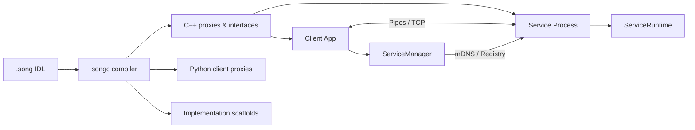

# Song: Services Over Native Gateways

A zero-dependency C++20 microservice framework with a custom IDL compiler, binary wire protocol, and process-isolated service hosting. Define services in `.song` IDL files, generate type-safe C++ and Python code, and communicate over pipes or TCP with HMAC-SHA256 security and zero-config mDNS discovery.

**551 tests (444 unit + 107 integration) | Zero warnings (-Wall -Wextra -Werror) | ~24K lines of C++20**

```song
// calculator.song                     // Write an IDL definition...
namespace calculator;
service Calculator {
    add(i32 a, i32 b) -> i32;
    divide(i32 a, i32 b) -> DivResult;
}
```
```bash
$ songc calculator.song -o output/     # ...generate C++ proxies, interfaces, dispatchers
$ songc --lang python calculator.song  # ...or generate Python clients with type hints
$ songc --scaffold calculator.song     # ...or generate implementation skeletons
```
```cpp
// Client code — same API for local pipes, TCP, or mDNS-discovered services
ServiceManager mgr;
mgr.register_service("calc", "./calculator_service", 1);  // local
auto conn = mgr.connect("calc");
CalculatorProxy calc(conn);
std::cout << calc.add(5, 3) << "\n";   // → 8 (type-safe RPC call)
```

## Features

- **Zero Dependencies**: No protobuf, no gRPC, no reflection library. Just POSIX and platform crypto.
- **Full IDL Compiler**: Hand-written lexer, recursive descent parser, semantic resolver, multi-target code generation (C++ and Python)
- **Binary Wire Protocol**: 16-byte fixed headers, version negotiation, capability exchange, `static_assert` on all struct sizes
- **Process Isolation**: Services run as separate processes with crash containment, auto-restart, and hot replacement
- **Three Transport Modes**: Local pipes, explicit TCP, or zero-config mDNS discovery — all behind a unified API
- **HMAC-SHA256 Security**: Constant-time verification, transparent decorator over any transport, platform-adaptive crypto (CommonCrypto/OpenSSL)
- **Object Lifecycle**: Reference-counted remote objects with create/release/property access/method dispatch
- **Scaffold Sync**: Re-running the scaffold generator diffs against existing implementations, reporting new/removed/modified methods

## Architecture



```
+------------------+           +------------------+
|   Application    |           |   Application    |
+------------------+           +------------------+
        |                              |
        v                              v
+------------------+           +------------------+
|  Song Runtime    |<-- pipe ->|  Song Runtime    |  (local)
|  (Host Process)  |<-- TCP -->|  (Service Proc)  |  (remote)
+------------------+           +------------------+
        |                              |
        v                              v
+------------------+           +------------------+
|  Generated Code  |           |  Generated Code  |
|  (from .song)    |           |  (from .song)    |
+------------------+           +------------------+
```

## Components

| Component | Purpose |
|-----------|---------|
| **songc** | IDL compiler: `.song` files → C++ headers, Python clients, implementation scaffolds |
| **libsong** | Runtime library: wire protocol, serialization, process management, TCP transport, security |
| **ServiceManager** | Service lifecycle: fork/exec, auto-restart, TCP connections, mDNS discovery |

## Building

```bash
mkdir build && cd build
cmake .. -DCMAKE_BUILD_TYPE=Release
make -j

# Run all tests (551 tests)
ctest --output-on-failure
```

## Quick Start

### 1. Define a Service (calculator.song)

```song
namespace calculator;

struct DivResult {
    i32 quotient;
    i32 remainder;
}

service Calculator {
    add(i32 a, i32 b) -> i32;
    subtract(i32 a, i32 b) -> i32;
    multiply(i32 a, i32 b) -> i32;
    divide(i32 a, i32 b) -> DivResult;
}
```

### 2. Generate Code

```bash
./songc calculator.song -o output/
# Generates: output/calculator.hpp (single header with everything)

# Or split into separate files:
./songc --split calculator.song -o output/
# Generates: calculator_types.hpp, calculator_wire.cpp,
#            calculator_client.hpp, calculator_server.hpp

# Generate implementation skeleton:
./songc --scaffold calculator.song -o output/
# Generates: calculator_Calculator_impl.cpp (stub implementation)
# Re-running appends sync report showing new/removed/modified methods
```

### 3. Generate Python Client (Optional)

```bash
./songc --lang python calculator.song -o python/
# Generates: python/calculator.py (client proxy with type hints)
```

```python
from calculator import CalculatorProxy

proxy = CalculatorProxy(connection)
result = proxy.add(5, 3)  # Type-safe RPC call
```

### 4. Implement the Service

```cpp
#include "calculator.hpp"

using namespace song::calculator;

class CalculatorImpl : public ICalculator {
public:
    i32 add(i32 a, i32 b) override { return a + b; }
    i32 subtract(i32 a, i32 b) override { return a - b; }
    i32 multiply(i32 a, i32 b) override { return a * b; }
    DivResult divide(i32 a, i32 b) override {
        return {a / b, a % b};
    }
};

static CalculatorImpl g_calc;

void calc_dispatcher(u16 method_id, Buffer& request, Buffer& response) {
    dispatch_Calculator(g_calc, method_id, request, response);
}

int main() {
    ServiceRuntime runtime;
    runtime.register_dispatcher(kService_Calculator, calc_dispatcher);
    runtime.run();  // Pipe mode (stdin/stdout)
}
```

### 5. Write a Client

```cpp
#include "calculator.hpp"

using namespace song::calculator;

int main() {
    ServiceManager mgr;
    mgr.register_service("calc", "./calculator_service", 1);

    auto conn = mgr.connect("calc");
    CalculatorProxy calc(conn);

    std::cout << "5 + 3 = " << calc.add(5, 3) << "\n";
    std::cout << "10 - 4 = " << calc.subtract(10, 4) << "\n";

    auto div = calc.divide(17, 5);
    std::cout << "17 / 5 = " << div.quotient << " r " << div.remainder << "\n";
}
```

## Network Distribution

Song supports three communication modes with a unified API:

### Local Services (Pipes)
```cpp
ServiceManager mgr;
mgr.register_service("calc", "./calculator_service", 1);
auto conn = mgr.connect("calc");  // Spawns process, uses pipes
```

### Remote Services (TCP with explicit address)
```cpp
ServiceManager mgr;
mgr.register_remote_service("calc", "192.168.1.50", 12345, 1);
auto conn = mgr.connect("calc");  // TCP connection to host:port
```

### Discoverable Services (TCP with mDNS)
```cpp
ServiceManager mgr;
mgr.register_discoverable_service("calc", "calculator", 1);
auto conn = mgr.connect("calc");  // Discovers via mDNS, then TCP
```

### Running a TCP Service

```cpp
// Service that listens on TCP (explicit port)
int main() {
    ServiceRuntime runtime;
    runtime.register_dispatcher(kService_Calculator, calc_dispatcher);
    runtime.run_tcp(12345);  // Listen on port 12345
}

// Service with mDNS registration (zero-config discovery)
int main() {
    ServiceRuntime runtime;
    runtime.register_dispatcher(kService_Calculator, calc_dispatcher);
    runtime.run_tcp_discoverable(0, "MyCalculator", "calculator");
    // Registers as "_calculator._song._tcp" on local network
    // Port 0 = ephemeral port (OS-assigned)
}
```

## Security

Song provides HMAC-SHA256 authentication for services communicating over untrusted networks.

### Shared Secret Authentication

```cpp
// Configure security with a shared key
SecurityConfig security("my-secret-key-32-bytes-long!!!!");

// Client: wrap connection in SecureTransport
auto tcp = std::make_unique<TcpTransport>();
tcp->connect("192.168.1.50", 12345, 5000);
SecureTransport secure(std::move(tcp), security);

// Server: wrap accepted connection
auto client_tcp = listener.accept();
SecureTransport secure_client(std::move(client_tcp), security);
```

### How It Works

- HMAC-SHA256 computed over each message (header + payload)
- Tag embedded in wire protocol (transparent to application)
- Constant-time comparison prevents timing attacks
- Mismatched keys throw `SecurityError`

### Platform Support

| Platform | Crypto Library |
|----------|---------------|
| macOS    | CommonCrypto  |
| Linux    | OpenSSL       |

## Cross-Subnet Discovery (Registry)

When mDNS can't reach services (different VLANs, cloud environments), use a registry service.

### Running the Registry

```bash
# Start registry on a known host (default port 9999)
./registry_service --port 9999
```

### Client Configuration

```cpp
ServiceManager mgr;

// Configure registry for cross-subnet discovery
mgr.set_registry("registry.example.com", 9999);

// Register a discoverable service (will use registry as fallback)
mgr.register_discoverable_service("calc", "calculator", 1);

// Connect - tries mDNS first, then registry
auto conn = mgr.connect("calc");
```

### Service Registration

Services can register with the registry programmatically:

```cpp
RegistryClient registry("registry.example.com", 9999);

ServiceInfo info;
info.name = "my-calculator";
info.host = "10.0.0.50";
info.port = 12345;

registry.register_service(info);

// Keep alive with periodic heartbeats
while (running) {
    registry.heartbeat("my-calculator");
    sleep(30);
}
```

## Integration Test Suite (Sing)

The `sing/` folder contains complete example projects demonstrating Song's capabilities. Each project includes a `.song` IDL file, generated code, server implementation, and comprehensive integration tests.

See [sing/README.md](sing/README.md) for detailed documentation.

### IPC Tests (Local Pipes)

| Project | Tests | Description |
|---------|-------|-------------|
| [Calculator](sing/ipc/calculator/) | 26 | Basic arithmetic RPC, struct returns, error handling |
| [Stock Ticker](sing/ipc/stockticker/) | 15 | Complex structs, arrays of structs, batch queries |
| [Chat](sing/ipc/chat/) | 23 | Stateful server, message history, pagination |
| [Data Copy](sing/ipc/datacopy/) | 25 | Binary data, chunked file transfer, CRUD operations |

### Network Tests (TCP)

| Project | Tests | Description |
|---------|-------|-------------|
| [TCP Calculator](sing/network/tcp_calculator/) | 9 | Calculator service over TCP sockets |
| [Discovery](sing/network/discovery/) | 4 | mDNS zero-config service discovery |
| [Secure](sing/network/secure/) | 5 | HMAC-SHA256 authenticated communication |

### Running Integration Tests

```bash
cd build

# Run all integration tests
ctest -R sing_

# Run individual test suites
./sing/ipc/calculator/sing_ipc_calculator_test
./sing/network/tcp_calculator/sing_network_tcp_calculator_test
```

## Scaffold Sync

One of Song's most practical features: when you modify your `.song` IDL and re-run the scaffold generator, it parses your existing implementation file, diffs it against the current IDL, and appends a structured sync report:

```bash
$ songc --scaffold calculator.song -o output/
# First run: generates calculator_Calculator_impl.cpp with method stubs

# Later, after adding new methods to calculator.song:
$ songc --scaffold calculator.song -o output/
# Appends sync report to existing file:
```

```
// SCAFFOLD SYNC REPORT - calculator.song
// ========================================
// NEW METHODS (add these to your implementation):
//   i64 factorial(i32 n)
//   i64 sum(i32[] values)
//
// REMOVED METHODS (safe to delete):
//   void deprecated_method()
//
// MODIFIED SIGNATURES (update your implementation):
//   divide: return type changed from i32 to DivResult
```

This means you never lose work when evolving your IDL. The compiler tells you exactly what changed and what you need to update.

## Status

All core features are complete and tested:

| Component | Status | Key Details |
|-----------|--------|-------------|
| **Runtime** | Complete | Buffer (4KB SBO), wire protocol, process management, auto-restart |
| **IDL Compiler** | Complete | Lexer, parser, resolver, C++ codegen, Python codegen, scaffold sync |
| **Networking** | Complete | TCP transport, mDNS discovery (macOS), registry fallback |
| **Security** | Complete | HMAC-SHA256, constant-time verification, platform crypto |
| **Object System** | Complete | Reference-counted remote objects, create/release/property/method dispatch |
| **Logging** | Complete | Handler-based, colored console, source location capture, introspection |
| **Tests** | 551 total | 444 unit tests + 107 integration tests across 7 projects |

## Project Structure

```
song/
├── CMakeLists.txt
├── include/song/
│   ├── buffer.hpp        # Buffer with small-buffer optimization
│   ├── pipe.hpp          # POSIX pipe wrapper
│   ├── wire.hpp          # Wire protocol definitions
│   ├── process.hpp       # Service process management
│   ├── manager.hpp       # Service lifecycle manager
│   ├── runtime.hpp       # Service-side runtime
│   ├── transport.hpp     # Transport interface (pipes, TCP)
│   ├── discovery.hpp     # mDNS service discovery
│   ├── security.hpp      # HMAC authentication
│   ├── registry.hpp      # Cross-subnet registry
│   ├── object.hpp        # Object base class and registry
│   ├── logging.hpp       # Pluggable logging system
│   ├── error.hpp         # Error types
│   └── song.hpp          # Main include
├── src/
│   ├── buffer.cpp
│   ├── pipe.cpp
│   ├── wire.cpp
│   ├── process.cpp
│   ├── manager.cpp
│   ├── runtime.cpp
│   ├── transport.cpp     # TCP/pipe transport implementations
│   ├── discovery.cpp     # mDNS implementation (macOS Bonjour)
│   ├── security.cpp      # HMAC (CommonCrypto/OpenSSL)
│   ├── registry.cpp      # Registry client/server
│   ├── object.cpp        # ObjectRegistry implementation
│   └── logging.cpp       # Logging implementation
├── compiler/
│   ├── ast.hpp              # AST node definitions
│   ├── lexer.hpp/cpp        # Tokenizer for Song IDL
│   ├── parser.hpp/cpp       # Recursive descent parser
│   ├── resolver.hpp/cpp     # Semantic analysis
│   ├── codegen.hpp/cpp      # C++ code generation
│   ├── python_codegen.hpp/cpp  # Python client generation
│   ├── scaffold.hpp/cpp     # Implementation skeleton generation
│   └── main.cpp             # songc entry point
├── test/                    # Unit tests (444 tests)
├── examples/
│   ├── echo/             # Echo service example
│   ├── calculator/       # Generated calculator example
│   ├── crash/            # Auto-restart test
│   └── registry/         # Registry service
└── sing/                 # Integration test suite (94 tests)
    ├── README.md         # Sing documentation
    ├── ipc/              # Local pipe-based tests
    │   ├── calculator/   # Basic RPC patterns
    │   ├── stockticker/  # Complex types, arrays
    │   ├── chat/         # Stateful services
    │   └── datacopy/     # Binary data handling
    └── network/          # TCP network tests
        ├── tcp_calculator/  # TCP transport
        ├── discovery/       # mDNS discovery
        └── secure/          # HMAC authentication
```

## Code Quality

- **NO WARNINGS ALLOWED**: Code compiles with `-Wall -Wextra -Werror`
- MIT License headers on all source files (enforced by pre-commit hook)
- Trailing newlines enforced (pre-commit hook)

## Performance Characteristics

- **Message overhead**: 16 bytes per message (fixed header)
- **Small buffer optimization**: First 4KB inline (no heap allocation)
- **Zero-copy**: Large buffers can be passed by reference
- **Latency**: Sub-microsecond for simple messages on localhost

## Design Philosophy: Why Build This Instead of Using gRPC?

Song isn't "better than gRPC." It makes different tradeoffs, built from scratch to understand the problem space deeply:

- **Zero external dependencies**: No protobuf, no gRPC, no reflection library. Song compiles with just a C++20 compiler and POSIX. This matters for embedded Linux, IoT, and resource-constrained environments where pulling in gRPC's dependency tree is impractical.
- **Process isolation as a first-class concept**: gRPC treats transport as a networking concern. Song treats it as a process management concern. Services are fork/exec'd child processes with automatic restart, crash containment, and hot replacement built into the framework, not bolted on.
- **Integrated lifecycle management**: The ServiceManager handles the full service lifecycle — spawning, monitoring, auto-restart with configurable limits, and graceful shutdown. With gRPC, you need separate tooling (systemd, Kubernetes) for this.
- **Hand-written compiler for the IDL**: No parser generators, no protoc plugins. The Song compiler is a complete pipeline (lexer → parser → resolver → codegen) that generates C++ *and* Python with scaffold sync. Understanding what protobuf does well enough to build it yourself is the point.
- **Learning the fundamentals**: This project exists to demonstrate deep understanding of wire protocols, serialization, process management, and compiler construction — not to compete with production RPC frameworks.

### Design Decisions

| Decision | Rationale |
|----------|-----------|
| **Pipes for local** | Simpler than sockets, faster, debugger-friendly (attach to service process) |
| **TCP + mDNS for remote** | Unified API across local/remote, zero-config on LAN, native OS APIs only |
| **Process isolation** | Crash containment, hot replacement, privilege separation, memory isolation |
| **Native endianness** | No byte swapping overhead; target clarity (embedded Linux is little-endian) |
| **16-byte fixed headers** | Predictable parsing, `static_assert` on all struct sizes, no variadic headers |

## Cross-Language Wire Compatibility

Song's wire protocol is language-independent. The Python client library implements byte-exact compatibility with the C++ runtime:

```python
# Python client talking to a C++ service over TCP
from song.connection import ServiceConnection
from song.generated.calculator import CalculatorProxy

conn = ServiceConnection.connect_tcp("localhost", 12345)
calc = CalculatorProxy(conn)

result = calc.add(5, 3)        # Python encodes → wire → C++ decodes → C++ encodes → wire → Python decodes
div = calc.divide(17, 5)       # Returns DivResult(quotient=3, remainder=2)
```

The Python library (`python/song/`) includes its own Buffer, wire protocol, and connection implementations — not FFI bindings. Both languages serialize to the same byte layout, verified by cross-language integration tests.

## Platform Support & Limitations

| Feature | macOS | Linux |
|---------|-------|-------|
| Core runtime (pipes, TCP) | Full | Full |
| HMAC-SHA256 security | CommonCrypto | OpenSSL |
| mDNS service discovery | Bonjour (dns_sd) | Planned (Avahi) |

**Known limitations:**
- **mDNS discovery is macOS-only** — Linux support requires Avahi integration (tracked for future work). TCP with explicit addresses and the registry service work on both platforms.
- **Streaming** — Wire protocol defines stream message types (`0x05`, `0x06`) but the runtime API doesn't expose them yet.
- **Property change notifications** — Planned but not yet implemented.
- **Native endianness only** — Cross-architecture communication (e.g., ARM ↔ x86) is not supported. Both endpoints must share endianness.

## References

- Wire protocol specification: [`include/song/wire.hpp`](include/song/wire.hpp)
- IDL grammar: [`compiler/parser.cpp`](compiler/parser.cpp)
- Integration test suite: [`sing/README.md`](sing/README.md)
- Python client library: [`python/`](python/)

## License

MIT License - Copyright (c) 2026 dbjwhs
