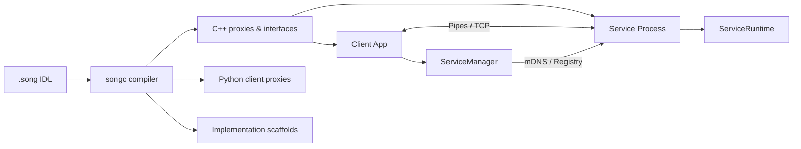

# Song: Services Over Native Gateways

A zero-dependency C++20 microservice framework with a custom IDL compiler, binary wire protocol, and process-isolated service hosting. Define services in `.song` IDL files, generate type-safe C++ and Python code, and communicate over pipes or TCP with TLS encryption, HMAC-SHA256 security, streaming RPC, and zero-config mDNS discovery.

**678 tests (571 unit + 107 integration) | Zero warnings (-Wall -Wextra -Werror) | ~30K lines of C++20**

```song
// calculator.song                     // Write an IDL definition...
namespace calculator;
service Calculator {
    add(i32 a, i32 b) -> i32;
    divide(i32 a, i32 b) -> DivResult;
}
```
```bash
$ songc calculator.song -o output/     # ...generate C++ proxies, interfaces, dispatchers
$ songc --lang python calculator.song  # ...or generate Python clients with type hints
$ songc --scaffold calculator.song     # ...or generate implementation skeletons
```
```cpp
// Client code — same API for local pipes, TCP, or mDNS-discovered services
ServiceManager mgr;
mgr.register_service("calc", "./calculator_service", 1);  // local
auto conn = mgr.connect("calc");
CalculatorProxy calc(conn);
std::cout << calc.add(5, 3) << "\n";   // → 8 (type-safe RPC call)
```

## Features

- **Zero Dependencies**: No protobuf, no gRPC, no reflection library. Just POSIX and platform crypto.
- **Full IDL Compiler**: Hand-written lexer, recursive descent parser, semantic resolver, multi-target code generation (C++ and Python)
- **Binary Wire Protocol**: 16-byte fixed headers, version negotiation, capability exchange, `static_assert` on all struct sizes
- **Process Isolation**: Services run as separate processes with crash containment, auto-restart, and hot replacement
- **Three Transport Modes**: Local pipes, explicit TCP, or zero-config mDNS discovery -- all behind a unified API
- **TLS Encryption**: Full mbedTLS 4.x integration with certificate and PSK modes, PIMPL-hidden from public API
- **HMAC-SHA256 Security**: Constant-time verification, transparent decorator over any transport, platform-adaptive crypto (CommonCrypto/OpenSSL)
- **Streaming RPC**: Server-side `StreamWriter` sends incremental chunks, client-side `StreamReader` collects them. Works over pipes, TCP, HMAC, and TLS.
- **Property Notifications**: Subscribe to property changes on remote objects. Thread-safe `SubscriptionRegistry` fans out `MSG_PROP_NOTIFY` to all subscribed clients.
- **Multi-Client Support**: `run_tcp_multi()` accepts concurrent clients (thread-per-client), all sharing the same object registry and subscription fan-out.
- **Version Negotiation**: Protocol v1.1 with semver major/minor rules, 32-bit capability bitfield (feature + extension + vendor slots), bidirectional `init_ack` handshake, and runtime-toggleable dynamic extensions
- **Object Lifecycle**: Reference-counted remote objects with create/release/property access/method dispatch
- **Scaffold Sync**: Re-running the scaffold generator diffs against existing implementations, reporting new/removed/modified methods

## Architecture



```
+------------------+           +------------------+
|   Application    |           |   Application    |
+------------------+           +------------------+
        |                              |
        v                              v
+------------------+           +------------------+
|  Song Runtime    |<-- pipe ->|  Song Runtime    |  (local)
|  (Host Process)  |<-- TCP -->|  (Service Proc)  |  (remote)
+------------------+           +------------------+
        |                              |
        v                              v
+------------------+           +------------------+
|  Generated Code  |           |  Generated Code  |
|  (from .song)    |           |  (from .song)    |
+------------------+           +------------------+
```

## Components

| Component | Purpose |
|-----------|---------|
| **songc** | IDL compiler: `.song` files → C++ headers, Python clients, implementation scaffolds |
| **libsong** | Runtime library: wire protocol, serialization, process management, TCP transport, security |
| **ServiceManager** | Service lifecycle: fork/exec, auto-restart, TCP connections, mDNS discovery |

## Building

### Dependencies

**macOS**: No external dependencies required (CommonCrypto is built-in). Optional: `brew install mbedtls` for TLS.

**Linux (Ubuntu/Debian)**:
```bash
sudo apt-get install build-essential cmake libssl-dev
# Optional:
sudo apt-get install libmbedtls-dev      # TLS encryption
sudo apt-get install libavahi-client-dev  # mDNS discovery
```

**Linux (Fedora/RHEL)**:
```bash
sudo dnf install gcc-c++ cmake openssl-devel
# Optional:
sudo dnf install mbedtls-devel    # TLS encryption
sudo dnf install avahi-devel      # mDNS discovery
```

### Build

```bash
mkdir build && cd build
cmake .. -DCMAKE_BUILD_TYPE=Release
make -j

# Run all tests
ctest --output-on-failure
```

## Quick Start

### 1. Define a Service (calculator.song)

```song
namespace calculator;

struct DivResult {
    i32 quotient;
    i32 remainder;
}

service Calculator {
    add(i32 a, i32 b) -> i32;
    subtract(i32 a, i32 b) -> i32;
    multiply(i32 a, i32 b) -> i32;
    divide(i32 a, i32 b) -> DivResult;
}
```

### 2. Generate Code

```bash
./songc calculator.song -o output/
# Generates: output/calculator.hpp (single header with everything)

# Or split into separate files:
./songc --split calculator.song -o output/
# Generates: calculator_types.hpp, calculator_wire.cpp,
#            calculator_client.hpp, calculator_server.hpp

# Generate implementation skeleton:
./songc --scaffold calculator.song -o output/
# Generates: calculator_Calculator_impl.cpp (stub implementation)
# Re-running appends sync report showing new/removed/modified methods
```

### 3. Generate Python Client (Optional)

```bash
./songc --lang python calculator.song -o python/
# Generates: python/calculator.py (client proxy with type hints)
```

```python
from calculator import CalculatorProxy

proxy = CalculatorProxy(connection)
result = proxy.add(5, 3)  # Type-safe RPC call
```

### 4. Implement the Service

```cpp
#include "calculator.hpp"

using namespace song::calculator;

class CalculatorImpl : public ICalculator {
public:
    i32 add(i32 a, i32 b) override { return a + b; }
    i32 subtract(i32 a, i32 b) override { return a - b; }
    i32 multiply(i32 a, i32 b) override { return a * b; }
    DivResult divide(i32 a, i32 b) override {
        return {a / b, a % b};
    }
};

static CalculatorImpl g_calc;

void calc_dispatcher(u16 method_id, Buffer& request, Buffer& response) {
    dispatch_Calculator(g_calc, method_id, request, response);
}

int main() {
    ServiceRuntime runtime;
    runtime.register_dispatcher(kService_Calculator, calc_dispatcher);
    runtime.run();  // Pipe mode (stdin/stdout)
}
```

### 5. Write a Client

```cpp
#include "calculator.hpp"

using namespace song::calculator;

int main() {
    ServiceManager mgr;
    mgr.register_service("calc", "./calculator_service", 1);

    auto conn = mgr.connect("calc");
    CalculatorProxy calc(conn);

    std::cout << "5 + 3 = " << calc.add(5, 3) << "\n";
    std::cout << "10 - 4 = " << calc.subtract(10, 4) << "\n";

    auto div = calc.divide(17, 5);
    std::cout << "17 / 5 = " << div.quotient << " r " << div.remainder << "\n";
}
```

## Network Distribution

Song supports three communication modes with a unified API:

### Local Services (Pipes)
```cpp
ServiceManager mgr;
mgr.register_service("calc", "./calculator_service", 1);
auto conn = mgr.connect("calc");  // Spawns process, uses pipes
```

### Remote Services (TCP with explicit address)
```cpp
ServiceManager mgr;
mgr.register_remote_service("calc", "192.168.1.50", 12345, 1);
auto conn = mgr.connect("calc");  // TCP connection to host:port
```

### Discoverable Services (TCP with mDNS)
```cpp
ServiceManager mgr;
mgr.register_discoverable_service("calc", "calculator", 1);
auto conn = mgr.connect("calc");  // Discovers via mDNS, then TCP
```

### Running a TCP Service

```cpp
// Service that listens on TCP (explicit port)
int main() {
    ServiceRuntime runtime;
    runtime.register_dispatcher(kService_Calculator, calc_dispatcher);
    runtime.run_tcp(12345);  // Listen on port 12345
}

// Service with mDNS registration (zero-config discovery)
int main() {
    ServiceRuntime runtime;
    runtime.register_dispatcher(kService_Calculator, calc_dispatcher);
    runtime.run_tcp_discoverable(0, "MyCalculator", "calculator");
    // Registers as "_calculator._song._tcp" on local network
    // Port 0 = ephemeral port (OS-assigned)
}
```

## Security

Song provides two security layers: HMAC-SHA256 for message authentication and TLS for full encryption.

### TLS Encryption (Recommended for untrusted networks)

```cpp
// Certificate-based TLS
TlsConfig config("server_cert.pem", "server_key.pem", "ca_cert.pem");
TlsListener listener;
listener.listen(config, 12345);
auto conn = listener.accept();  // Handshake included

// PSK-based TLS (lighter weight, no certificates needed)
TlsConfig psk_config("shared-secret-key", "my-identity", TlsConfig::Mode::psk);
```

### HMAC-SHA256 Authentication (For trusted LANs)

```cpp
// Configure security with a shared key
SecurityConfig security("my-secret-key-32-bytes-long!!!!");

// Client: wrap connection in SecureTransport
auto tcp = std::make_unique<TcpTransport>();
tcp->connect("192.168.1.50", 12345, 5000);
SecureTransport secure(std::move(tcp), std::move(security));

// Server: wrap accepted connection
auto client_tcp = listener.accept();
SecurityConfig srv_security("my-secret-key-32-bytes-long!!!!");
SecureTransport secure_client(std::move(client_tcp), std::move(srv_security));
```

### How It Works

- **TLS**: Full encryption via mbedTLS 4.x. Certificate or PSK mode. `MsgFlags::encrypted` set on all TLS messages.
- **HMAC**: SHA-256 computed over each message, 8-byte truncated tag, constant-time comparison, transparent decorator over any transport.
- Mismatched keys/certs throw `SecurityError`

### HMAC Tag Size

Song uses a truncated 8-byte (64-bit) HMAC tag rather than the full 32-byte SHA-256 output. This is a deliberate tradeoff:

- **Per-message overhead**: 8 bytes vs 32 bytes. At high message rates (100K+ msg/sec in IPC), the 24-byte savings per message is meaningful.
- **Security margin**: 64-bit tags provide 2^64 brute-force resistance, which is sufficient for integrity verification in a same-host or local-network IPC context where the attacker cannot observe enough messages to mount a birthday attack.
- **Complementary to TLS**: Song's HMAC layer provides message authentication (tamper detection), not confidentiality. For cross-network deployment, use Song's built-in TLS transport for encryption with HMAC as defense-in-depth.

This follows NIST SP 800-107 guidance that HMAC truncation to t bits provides t/2 bits of collision resistance, yielding 32-bit collision resistance — acceptable for the threat model (authenticated local/LAN IPC, not internet-facing).

### Platform Support

| Platform | HMAC | TLS | mDNS |
|----------|------|-----|------|
| macOS    | CommonCrypto | mbedTLS | Bonjour (dns_sd) |
| Linux    | OpenSSL | mbedTLS | Avahi |

## Streaming

Song supports server-push streaming where a method sends multiple incremental results before completion.

### Service Side

```cpp
// Register a streaming dispatcher instead of a regular one
void my_stream_handler(u16 method_id, Buffer& request, StreamWriter& writer) {
    i32 count = decode_i32(request);
    for (i32 i = 0; i < count; ++i) {
        Buffer chunk;
        encode_i32(chunk, i);
        writer.write(chunk);  // Sends MSG_STREAM
    }
    // MSG_STREAM_END sent automatically when writer goes out of scope
}

runtime.register_stream_dispatcher(kServiceId, my_stream_handler);
```

### Client Side

```cpp
Buffer args;
encode_i32(args, 100);
StreamReader reader = conn.call_streaming(service_id, method_id, args);

while (reader.next()) {
    i32 value = decode_i32(reader.chunk());
    // Process each chunk as it arrives
}
// reader.chunk_count() == 100
```

Streaming works over all transports (pipes, TCP, HMAC, TLS).

## Cross-Subnet Discovery (Registry)

When mDNS can't reach services (different VLANs, cloud environments), use a registry service.

### Running the Registry

```bash
# Start registry on a known host (default port 9999)
./registry_service --port 9999
```

### Client Configuration

```cpp
ServiceManager mgr;

// Configure registry for cross-subnet discovery
mgr.set_registry("registry.example.com", 9999);

// Register a discoverable service (will use registry as fallback)
mgr.register_discoverable_service("calc", "calculator", 1);

// Connect - tries mDNS first, then registry
auto conn = mgr.connect("calc");
```

### Service Registration

Services can register with the registry programmatically:

```cpp
RegistryClient registry("registry.example.com", 9999);

ServiceInfo info;
info.name = "my-calculator";
info.host = "10.0.0.50";
info.port = 12345;

registry.register_service(info);

// Keep alive with periodic heartbeats
while (running) {
    registry.heartbeat("my-calculator");
    sleep(30);
}
```

## Integration Test Suite (Sing)

The `sing/` folder contains complete example projects demonstrating Song's capabilities. Each project includes a `.song` IDL file, generated code, server implementation, and comprehensive integration tests.

See [sing/README.md](sing/README.md) for detailed documentation.

### IPC Tests (Local Pipes)

| Project | Tests | Description |
|---------|-------|-------------|
| [Calculator](sing/ipc/calculator/) | 26 | Basic arithmetic RPC, struct returns, error handling |
| [Stock Ticker](sing/ipc/stockticker/) | 15 | Complex structs, arrays of structs, batch queries |
| [Chat](sing/ipc/chat/) | 23 | Stateful server, message history, pagination |
| [Data Copy](sing/ipc/datacopy/) | 25 | Binary data, chunked file transfer, CRUD operations |

### Network Tests (TCP)

| Project | Tests | Description |
|---------|-------|-------------|
| [TCP Calculator](sing/network/tcp_calculator/) | 9 | Calculator service over TCP sockets |
| [Discovery](sing/network/discovery/) | 4 | mDNS zero-config service discovery |
| [Secure](sing/network/secure/) | 5 | HMAC-SHA256 authenticated communication |

### Running Integration Tests

```bash
cd build

# Run all integration tests
ctest -R sing_

# Run individual test suites
./sing/ipc/calculator/sing_ipc_calculator_test
./sing/network/tcp_calculator/sing_network_tcp_calculator_test
```

## Scaffold Sync

One of Song's most practical features: when you modify your `.song` IDL and re-run the scaffold generator, it parses your existing implementation file, diffs it against the current IDL, and appends a structured sync report:

```bash
$ songc --scaffold calculator.song -o output/
# First run: generates calculator_Calculator_impl.cpp with method stubs

# Later, after adding new methods to calculator.song:
$ songc --scaffold calculator.song -o output/
# Appends sync report to existing file:
```

```
// SCAFFOLD SYNC REPORT - calculator.song
// ========================================
// NEW METHODS (add these to your implementation):
//   i64 factorial(i32 n)
//   i64 sum(i32[] values)
//
// REMOVED METHODS (safe to delete):
//   void deprecated_method()
//
// MODIFIED SIGNATURES (update your implementation):
//   divide: return type changed from i32 to DivResult
```

This means you never lose work when evolving your IDL. The compiler tells you exactly what changed and what you need to update.

## Status

All core features are complete and tested:

| Component | Status | Key Details |
|-----------|--------|-------------|
| **Runtime** | Complete | Buffer (4KB SBO), wire protocol v1.1, process management, auto-restart |
| **IDL Compiler** | Complete | Lexer, parser, resolver, C++ codegen, Python codegen, scaffold sync |
| **Networking** | Complete | TCP transport, mDNS discovery (macOS), registry fallback |
| **TLS Encryption** | Complete | mbedTLS 4.x, certificate and PSK modes, PIMPL design |
| **HMAC Security** | Complete | HMAC-SHA256, constant-time verification, platform crypto |
| **Streaming** | Complete | StreamWriter (service), StreamReader (client), works over all transports |
| **Versioning** | Complete | Semver v1.1, 32-bit capability bitfield, bidirectional init_ack, dynamic extensions |
| **Property Notifications** | Complete | Subscribe/unsubscribe, fan-out via SubscriptionRegistry, multi-client push |
| **Multi-Client** | Complete | `run_tcp_multi()` thread-per-client, shared object registry and subscriptions |
| **Object System** | Complete | Reference-counted remote objects, create/release/property/method dispatch |
| **Logging** | Complete | Handler-based, colored console, source location capture, introspection |
| **Tests** | 678 total | 571 unit tests + 107 integration tests across 7 projects |

## Code Quality

- **NO WARNINGS ALLOWED**: Code compiles with `-Wall -Wextra -Werror`
- MIT License headers on all source files (enforced by pre-commit hook)
- Trailing newlines enforced (pre-commit hook)

## Performance

Measured on Apple M4 (macOS, Release build with `-O3 -march=native -flto`):

| Operation | Latency | Notes |
|-----------|---------|-------|
| Buffer encode/decode (i32 + i64 + f64 + string) | 0.012 us | 12 nanoseconds per complete roundtrip |
| Wire header encode/decode | < 0.1 us | 16-byte fixed header |
| Pipe RPC round-trip (call + response) | ~6 us | Full path: serialize → kernel pipe I/O → deserialize → dispatch → return |
| TCP round-trip (localhost) | ~100-200 us | Includes kernel socket overhead |
| Process startup (fork/exec + init handshake) | ~100 ms | One-time cost per service, amortized over all calls |

- **Message overhead**: 16 bytes per message (fixed header)
- **Small buffer optimization**: First 4KB inline (no heap allocation)
- **Zero-copy**: Large buffers can be passed by reference

Pipe RPC latency measured by `test/stress_test.cpp` over 1000 sequential calls to a forked service process.

## Wire Protocol Design Decisions

| Decision | Rationale |
|----------|-----------|
| **Little-endian wire format** | Compile-time enforced via `static_assert(std::endian::native == std::endian::little)`. This is the same choice made by protobuf, FlatBuffers, and Cap'n Proto. Covers x86, ARM (LE mode), RISC-V — effectively all modern targets. Eliminates byte-swapping overhead entirely. |
| **Pipes for local IPC** | Simpler than sockets, faster, debugger-friendly (attach to service process directly) |
| **TCP + mDNS for remote** | Unified API across local/remote, zero-config on LAN, native OS APIs only (no dependencies) |
| **Process isolation** | Crash containment, hot replacement, privilege separation, memory isolation |
| **16-byte fixed headers** | Predictable parsing, `static_assert` on all struct sizes, no variadic headers |
| **8-byte HMAC tags** | NIST SP 800-107 compliant truncation; 24 bytes saved per message at 100K+ msg/sec (see [Security](#hmac-tag-size)) |

## Design Philosophy

Song occupies a specific niche: zero-dependency process-isolated IPC for environments where gRPC's dependency tree is impractical. Embedded Linux, IoT gateways, and resource-constrained systems that need structured RPC but can't afford to pull in protobuf, gRPC, and their transitive dependencies.

The framework is built from scratch — not because reinventing the wheel is the goal, but because the requirements demanded it:

- **Zero external dependencies**: Song compiles with just a C++20 compiler and POSIX. No protobuf, no gRPC, no reflection library.
- **Process isolation as a first-class concept**: gRPC treats transport as a networking concern. Song treats it as a process management concern. Services are fork/exec'd child processes with automatic restart, crash containment, and hot replacement built into the framework.
- **Integrated lifecycle management**: ServiceManager handles spawning, health monitoring, auto-restart with configurable limits, and graceful shutdown. With gRPC, you need separate tooling (systemd, Kubernetes) for this.
- **Hand-written compiler**: The Song compiler is a complete pipeline (lexer → parser → resolver → codegen) that generates C++ and Python from a single IDL, with scaffold sync to track implementation drift. No parser generators, no protoc plugins.

For internet-facing services with broad language support, use gRPC. For same-host or LAN-scoped IPC where you control both endpoints and need minimal footprint, Song delivers the full stack in a single statically-linked library.

## Cross-Language Wire Compatibility

Song's wire protocol is language-independent. The Python client library implements byte-exact compatibility with the C++ runtime:

```python
# Python client talking to a C++ service over TCP
from song.connection import ServiceConnection
from song.generated.calculator import CalculatorProxy

conn = ServiceConnection.connect_tcp("localhost", 12345)
calc = CalculatorProxy(conn)

result = calc.add(5, 3)        # Python encodes → wire → C++ decodes → C++ encodes → wire → Python decodes
div = calc.divide(17, 5)       # Returns DivResult(quotient=3, remainder=2)
```

The Python library (`python/song/`) includes its own Buffer, wire protocol, and connection implementations — not FFI bindings. Both languages serialize to the same byte layout, verified by cross-language integration tests.

## Platform Support & Limitations

| Feature | macOS | Linux |
|---------|-------|-------|
| Core runtime (pipes, TCP) | Full | Full |
| HMAC-SHA256 security | CommonCrypto | OpenSSL 3.x |
| TLS encryption | mbedTLS | mbedTLS |
| mDNS service discovery | Bonjour (dns_sd) | Avahi |
| Streaming RPC | Full | Full |

**Known limitations:**
- **TLS requires mbedTLS** -- Optional dependency; builds without it (SONG_HAS_TLS compile flag).
- **mDNS requires platform library** -- Bonjour on macOS (built-in), Avahi on Linux (`libavahi-client-dev`). Both optional; builds without them, discovery tests skip.

## References

- Wire protocol specification: [`include/song/wire.hpp`](include/song/wire.hpp)
- IDL grammar: [`compiler/parser.cpp`](compiler/parser.cpp)
- Integration test suite: [`sing/README.md`](sing/README.md)
- Python client library: [`python/`](python/)

## License

MIT License - Copyright (c) 2026 dbjwhs
